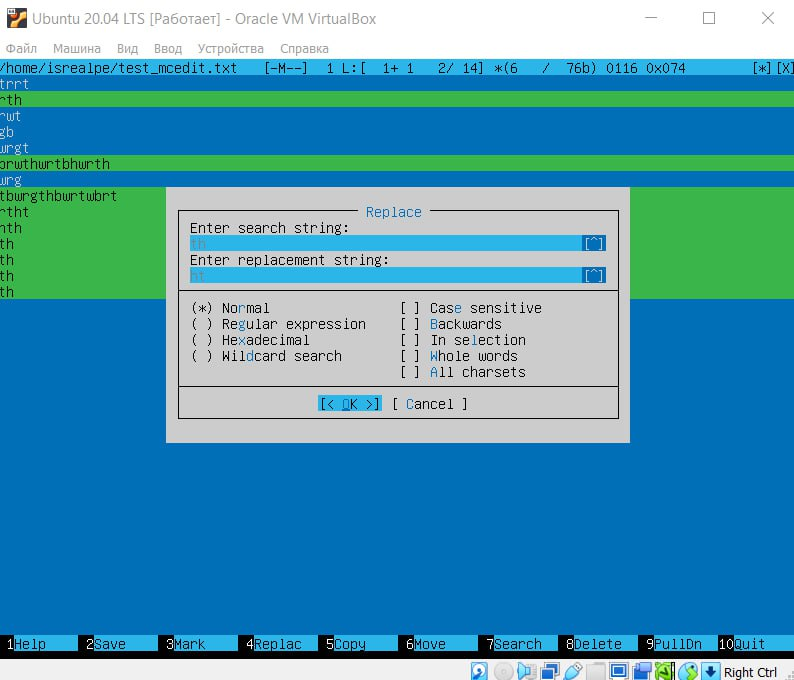
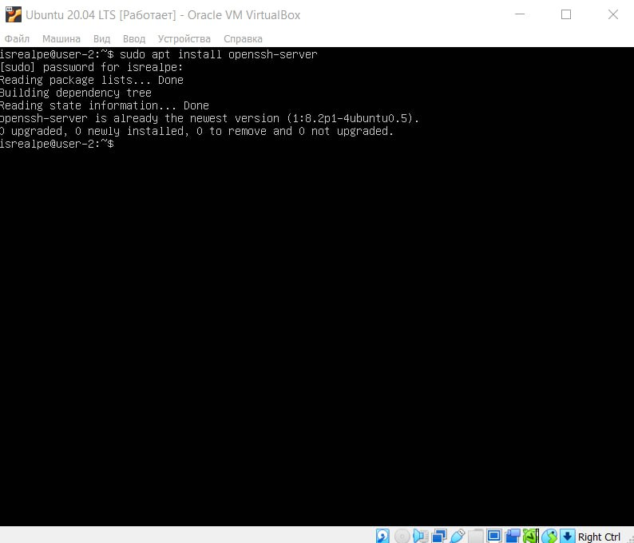
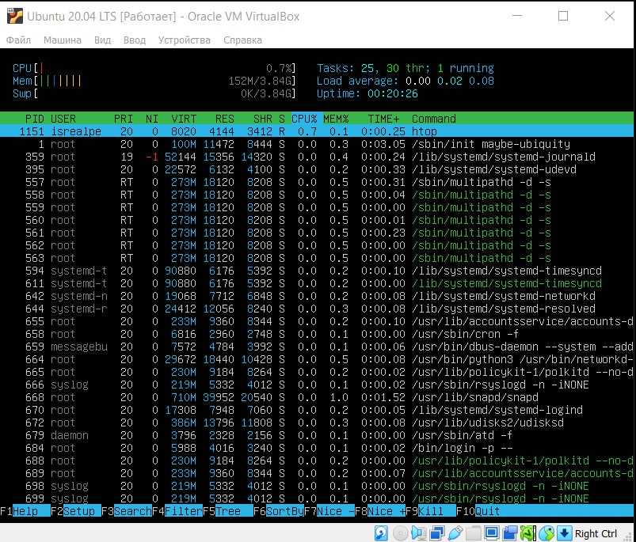
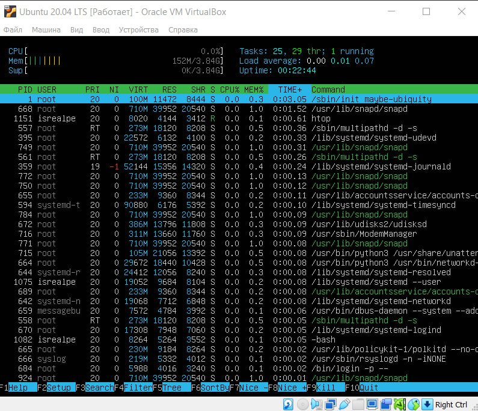
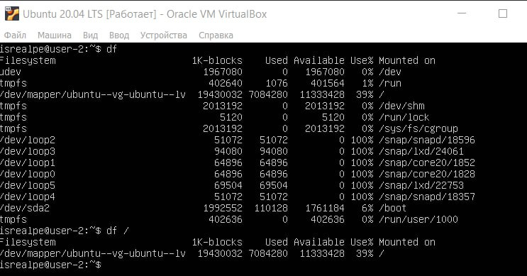

# Операционные системы UNIX/Linux

## Содержание
1. [Установка ОС](#part-1-установка-ос) 
2. [Создание пользователя](#part-2-создание-пользователя)
3. [Настройка сети ОС](#part-3-настройка-сети-ос)
4. [Обновление ОС](#part-4-обновление-ос)
5. [Использование команды **sudo**](#part-5-использование-команды-sudo)
6. [Установка и настройка службы времени](#part-6-установка-и-настройка-службы-времени)
7. [Установка и использование текстовых редакторов](#part-7-установка-и-использование-текстовых-редакторов)
8. [Установка и базовая настройка сервиса **SSHD**](#part-8-установка-и-базовая-настройка-сервиса-sshd)
9. [Установка и использование утилит **top**, **htop**](#part-9-установка-и-использование-утилит-top-htop)
10. [Использование утилиты **fdisk**](#part-10-использование-утилиты-fdisk)
11. [Использование утилиты **df**](#part-11-использование-утилиты-df)
12. [Использование утилиты **du**](#part-12-использование-утилиты-du)
13. [Установка и использование утилиты **ncdu**](#part-13-установка-и-использование-утилиты-ncdu)
14. [Работы с системными журналами](#part-14-работы-с-системными-журналами)
15. [Использование планировщика заданий **CRON**](#part-15-использование-планировщика-заданий-cron)

****

## Part 1. Установка ОС
##### Версия Ubuntu, команда `cat /etc/issue`:

****
## Part 2. Создание пользователя
##### 1. Команда для создания пользователя:

##### 2. Вывод команды `cat /etc/passwd`:

*****
## Part 3. Настройка сети ОС
##### 1. Новое нзвание машины:

##### 2. Подходящая временная зона (`timedatectl set-timezone Europe/Moscow`):

##### 3. Названия сетевых интерфейсов с помощью команды `ip a`:

 Интерфейс lo (loopback) используется для отладки сетевых программ и запуска серверных приложений на локальной машине. Он позволяет программам обращаться к этому компьютеру.
##### 4. ip адрес от DHCP сервера (строка fixed-address):

 Dynamic Host Configuration Protocol (DHCP) — автоматический предоставляет ip адреса и прочие настройки сети (маску сети, шлюз и т.п) компьютерам и различным устройствам в сети.
 ##### 5. Внешний ip адрес:

 ##### 6. Внутренний ip адрес:

 ##### 7. Задание статичных настроек ip, gw, dns:

`sudo vim etc/netplan/00-installer-config.yaml`

##### 8. `ping -c 5 1.1.1.1`

##### 9. `ping -c 5 ya.ru`

****
## Part 4. Обновление ОС
##### Обновление системных пакетов до последней версии

****
## Part 5. Использование команды **sudo**
##### Разрешение пользователю выполнять команду sudo.

В ходе работы я поняла, что забыла пароль от второго пользователя. Чтобы изменить его, действовала следующим образом:
1) `sudo -i`, чтобы стать суперпользователем;
2) `passwd karina`, чтобы изменить пароль;
3) `exit`, чтобы выйти из режима суперпользователя

`Sudo` — это утилита, предоставляющая привилегии root для выполнения административных операций в соответствии со своими настройками. Она позволяет легко контролировать доступ к важным приложениям в системе. По умолчанию, при установке Ubuntu первому пользователю (тому, который создаётся во время установки) предоставляются полные права на использование sudo. Т.е. фактически первый пользователь обладает той же свободой действий, что и root.
****
## Part 6. Установка и настройка службы времени
##### Установка и настройка службы времени

****
## Part 7. Установка и использование текстовых редакторов
##### Установка текстовых редакоторов **VIM**, **NANO**, **MCEDIT**
Для этого нужно прописать следующие команды:
`sudo apt install vim`
`sudo apt install nano`
`sudo apt install mcedit`
##### VIM
Выход из режима редактирования: esc
Режим редактирования: I

Выход с сохравнением: :wq

Выход без сохранения: :q!

Поиск слова: /нужное слово

Замена: s/то, что нужно заменить/то, на что надо заменить

##### NANO

Выход с сохравнением: CTRL + O

Выход без сохранения: CTRL + X N

Поиск слова: CTRL + W

Замена: CTRL + \

##### MCEDIT

Выход с сохравнением: F2 -> yes + F10

Выход без сохранения: F10 -> no

Поиск слова: F7 -> ввести нужное слово -> find all

Замена: F4 -> ввести то, что нужно заменить -> ввести то, на что надо заменить

****
## Part 8. Установка и базовая настройка сервиса **SSHD**
##### Установка службы SSHd

##### Добавление автостарта службы

##### Перенесение службы SSHd на порт 2022

`sudo systemctl restart sshd`

##### Наличие процессора SSHd

ps (processes status) - встроенная утилита Linux для просмотра информации, касающейся выбора запущенных процессов в системе.
Ключи:
`-` -А, -е - выбрать все процессы;

`-` -а - выбрать все процессы, кроме фоновых;

`-` -d - выбрать все процессы, даже фоновые, кроме процессоров сессий;

`-` -N - выбрать все процессы, кроме указанных;

`-` Т - все процессы на конкретном терминале;

`-` а - процессы, связанные с текущим терминалом, а так же процессы других пользователей;

`-` r - информация только о работащих процессах;

`-` х - процессы, отсоединенные от терминала;

`-` -С - выбирать процессы по имени команды;

`-` -G - выбрать процессы по ID группы;

`-` -р - выбрать процессы PID;

`-` --ppid - выбрать процессы по PID радительского процесса;

`-` -s - выбрать процессы по ID сессии;

`-` -t - выбрать процессы по tty;

`-` -u - выбрать процессы пользователя

`netstat -tan`

`-` -t (--tcp) отображает соедниеня только по tcp

`-` -а (--all) выводит и все активные подключения TCP

`-` -n (--numeric) вывод активных подключений TCP с отображением адресов и номеров портов в числовом формате

`-` Proto - название протокола

`-` Recv-Q - количество байтов, не скопированных пользовательской программой, подключенной к этому сокету

`-` Send-Q - счетчик байтов, не подтверждённых удалённым узлом

`-` Local address - локальный IP-адрес

`-` Foreing address - внешний IP-адрес

`-` State - состояние соединения

0.0.0.0 означает IP-адрес на локальной машине

****
## Part 9. Установка и использование утилит **top**, **htop**

`-` uptime - 35 min

`-` количество авторизированных пользователей - 1

`-` общая загрузка системы - 0,00 0,00 0,02

`-` общее количество процессов - 96

`-` загрузка cpu - 0,7%

`-` загрузка памяти - 153М/3,48G

`-` pid процесса занимающего больше всего памяти - 668

`-` pid процесса, занимающего больше всего процессорного времени - 1151

##### Сортировка по PID

##### Сортировка по PERCENT_CPU

##### Сортировка по PERCENT_MEM

##### Сортировка по TIME

##### Фильтр для SSHD

##### Процесс syslog

##### Добавление вывода hostname, clock и uptime

****
## Part 10. Использование утилиты **fdisk**

`-` название жесткого диска (это который /dev/sda) - VBOX HARDDISK

`-` размер - 40G

`-` количество секторов - 83886080 килобайт

`-` размер swap - 3,9G

****
## Part 11. Использование утилиты **df**

##### `df`

`-` размер раздела - 19430032

`-` размер занятого пространства - 7084280

`-` размер свободного пространства - 11333428

`-` процент использования - 39%

единица измерения - килобайты

`-` размер раздела - 19

`-` размер занятого пространства - 6,8

`-` размер свободного пространства - 11

`-` процент использования - 39%

единица измерения - G

****
## Part 12. Использование утилиты **du**

##### В байтах

##### В человекочитаемом виде

##### Содержимое папки var/log

****
## Part 13. Установка и использование утилиты **ncdu**

##### Установка:

`sudo apt install ncdu`

##### Размер /home

##### Размер /var

##### Размер /var/log

****
## Part 14. Работы с системными журналами

##### Открыть для просмотра:

`sudo vim /var/log/dmesg`

`sudo vim /var/log/syslog`

`sudo vim /var/log/auth.log`

`-` время последней успешной авторизации: 21:40:29

`-` имя пользователя: isrealpe

`-` метод входа в систему: LOGIN

##### Перезапуск службы SSHd

****
## Part 15. Использование планировщика заданий **CRON**

##### Запуск uptime через каждые 2 минуты

##### Записи в системном журнале

##### Список текущих задач

##### Удаление всех записей

